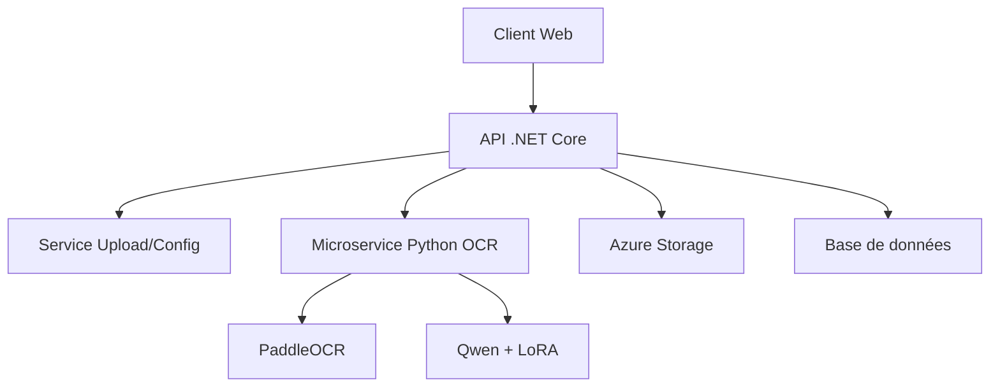
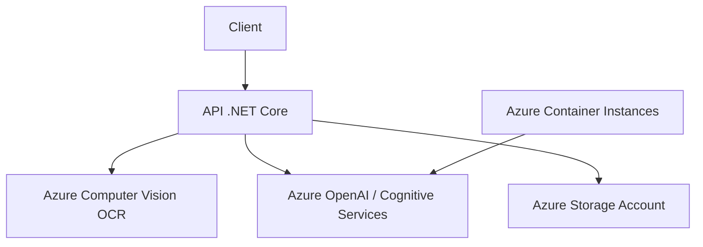

# Étude de Faisabilité : Migration OCR-POC vers .NET Core

## Table des Matières
1. [Analyse de l'Architecture Actuelle](#analyse-de-larchitecture-actuelle)
2. [Défis Techniques de Migration](#défis-techniques-de-migration)
3. [Solutions Proposées](#solutions-proposées)
4. [Architecture .NET Cible](#architecture-net-cible)
5. [Stratégie de Déploiement Azure](#stratégie-de-déploiement-azure)
6. [Estimation des Efforts](#estimation-des-efforts)
7. [Recommandations](#recommandations)

---

## Analyse de l'Architecture Actuelle

### 🏗️ **Composants Python Existants**

#### **1. Backend Flask**
```python
- app.py : API REST avec endpoints /upload, /test
- Routes : Upload multipart, traitement asynchrone
- Configuration : Modèles, logging, gestion d'erreurs
```

#### **2. Modules OCR**
```python
ocr/
├── paddle_extractor.py      # PaddleOCR pour extraction de texte
├── llm_post_processor.py    # Modèle Qwen de base
├── llm_post_processor_lora.py # Modèle Qwen avec adapteur LoRA
├── id_card_data_extractor.py # Orchestrateur principal
├── card_side.py / card_version.py # Enums configuration
```

#### **3. Modèles ML**
```
models/
├── Qwen/Qwen3-0.6B/         # Modèle de base (602M paramètres)
├── finetunes/               # Adapteurs LoRA (~1.3M paramètres)
└── Formats: .safetensors, .json, .bin
```

#### **4. Interface Web**
```html
- templates/index.html : Interface 2 colonnes
- Upload drag&drop, preview, progress bar
- Affichage résultats (texte brut + JSON structuré)
```

---

## Défis Techniques de Migration

### 🚨 **Défis Majeurs**

#### **1. Écosystème ML Python → .NET**
| Composant | Python | .NET | Difficulté |
|-----------|--------|------|------------|
| **PaddleOCR** | Native Python | ❌ Pas d'équivalent direct | 🔴 **CRITIQUE** |
| **Transformers** | HuggingFace | ✅ ML.NET / ONNX | 🟡 **MOYEN** |
| **PyTorch** | Native | ✅ TorchSharp / ONNX Runtime | 🟡 **MOYEN** |
| **PEFT/LoRA** | Native Python | ❌ Pas de support direct | 🔴 **CRITIQUE** |

#### **2. Format des Modèles**
- **Actuel** : `.safetensors`, format PyTorch/HuggingFace
- **Requis** : Conversion vers ONNX ou format ML.NET
- **Problème** : Les adapteurs LoRA ne sont pas directement convertibles

#### **3. Performance et Mémoire**
- **Python** : GIL, mais librairies optimisées (C++)
- **.NET** : Threading natif, mais écosystème ML moins mature
- **Modèles** : 600M+ paramètres nécessitent optimisation mémoire

---

## Solutions Proposées

### 💡 **Approche Hybride (Recommandée)**

#### **Option 1 : API .NET + Microservice Python**


**Avantages :**
- ✅ Réutilise l'expertise Python ML existante
- ✅ Migration progressive possible
- ✅ Meilleure séparation des responsabilités
- ✅ Scalabilité indépendante

**Inconvénients :**
- ❌ Complexité déploiement (2 services)
- ❌ Latence réseau inter-services
- ❌ Gestion des erreurs distribuées

#### **Option 2 : Migration Complète vers .NET**

**Composants de Remplacement :**

| Python | .NET Équivalent | Statut |
|--------|-----------------|---------|
| PaddleOCR | **Tesseract.NET** + Custom Vision API | 🟡 Moins précis |
| HuggingFace Transformers | **ML.NET** + ONNX Runtime | 🟢 Possible |
| PyTorch LoRA | **❌ Non disponible** | 🔴 Bloquant |
| Flask | ASP.NET Core Web API | 🟢 Équivalent |

#### **Option 3 : Migration avec Services Azure**



**Services Azure utilisés :**
- **Azure Computer Vision** : Remplacement PaddleOCR
- **Azure OpenAI** : Remplacement modèles Qwen
- **Azure Container Instances** : Pour modèles custom si nécessaire

---

## Architecture .NET Cible

### 🏛️ **Structure Proposée**

```
OCR.Api/
├── Controllers/
│   ├── UploadController.cs      # API upload et traitement
│   └── HealthController.cs      # Health checks
├── Services/
│   ├── IOcrService.cs           # Interface OCR
│   ├── PythonOcrService.cs      # Appel microservice Python
│   ├── AzureOcrService.cs       # Azure Computer Vision
│   └── FileStorageService.cs    # Gestion fichiers
├── Models/
│   ├── CardData.cs              # DTOs pour cartes d'identité
│   ├── OcrResult.cs             # Résultats OCR
│   └── ProcessingRequest.cs     # Requêtes traitement
├── Configuration/
│   ├── OcrSettings.cs           # Configuration services
│   └── AzureSettings.cs         # Configuration Azure
└── Infrastructure/
    ├── Logging/                 # Logging structuré
    ├── Middleware/              # Gestion erreurs, CORS
    └── Extensions/              # Extensions DI
```

### 🔧 **Technologies .NET**

```xml
<PackageReferences>
  <!-- Web API -->
  <PackageReference Include="Microsoft.AspNetCore.App" />
  
  <!-- ML et Vision -->
  <PackageReference Include="Microsoft.ML" />
  <PackageReference Include="Microsoft.ML.OnnxRuntime" />
  <PackageReference Include="Azure.AI.Vision.ImageAnalysis" />
  
  <!-- Storage et Cache -->
  <PackageReference Include="Azure.Storage.Blobs" />
  <PackageReference Include="Microsoft.Extensions.Caching.Memory" />
  
  <!-- Monitoring -->
  <PackageReference Include="Serilog.AspNetCore" />
  <PackageReference Include="ApplicationInsights.AspNetCore" />
  
  <!-- HTTP Client -->
  <PackageReference Include="Microsoft.Extensions.Http.Polly" />
</PackageReferences>
```

---

## Stratégie de Déploiement Azure

### ☁️ **Architecture Azure Recommandée**

```yaml
# azure-pipelines.yml
trigger:
- main

pool:
  vmImage: 'ubuntu-latest'

stages:
- stage: Build
  jobs:
  - job: BuildAPI
    steps:
    - task: DotNetCoreCLI@2
      inputs:
        command: 'build'
        projects: '**/*.csproj'
    
    - task: Docker@2
      inputs:
        command: 'build'
        dockerfile: 'OCR.Api/Dockerfile'

- stage: Deploy
  jobs:
  - deployment: DeployToAzure
    environment: 'production'
    strategy:
      runOnce:
        deploy:
          steps:
          - task: AzureWebApp@1
            inputs:
              appName: 'ocr-api-prod'
              package: '$(Pipeline.Workspace)/**/*.zip'
```

### 🏗️ **Ressources Azure Nécessaires**

#### **Option Hybride :**
```json
{
  "resources": {
    "appService": {
      "name": "ocr-api-dotnet",
      "sku": "S1",
      "runtime": ".NET Core 8.0"
    },
    "containerInstances": {
      "name": "ocr-python-service",
      "cpu": 2,
      "memory": "4GB",
      "image": "ocr-python:latest"
    },
    "storage": {
      "name": "ocrstorageaccount",
      "tier": "Standard"
    },
    "applicationInsights": {
      "name": "ocr-monitoring"
    }
  }
}
```

#### **Option Services Azure :**
```json
{
  "resources": {
    "appService": {
      "name": "ocr-api-dotnet",
      "sku": "S2"
    },
    "cognitiveServices": {
      "name": "ocr-computer-vision",
      "sku": "S1"
    },
    "openAI": {
      "name": "ocr-text-processing",
      "model": "gpt-4o-mini"
    }
  }
}
```

---

## Estimation des Efforts

### ⏱️ **Temps de Développement**

| Phase | Option Hybride | Migration Complète | Services Azure |
|-------|----------------|-------------------|----------------|
| **Architecture & Setup** | 1 semaine | 2 semaines | 1 semaine |
| **API .NET Core** | 2 semaines | 2 semaines | 2 semaines |
| **Service OCR** | 1 semaine | 4 semaines | 3 semaines |
| **Intégration & Tests** | 2 semaines | 3 semaines | 2 semaines |
| **Déploiement Azure** | 1 semaine | 1 semaine | 1 semaine |
| **Documentation** | 1 semaine | 1 semaine | 1 semaine |
| **TOTAL** | **8 semaines** | **13 semaines** | **10 semaines** |

### 💰 **Coûts Azure (Mensuel)**

| Ressource | Option Hybride | Services Azure |
|-----------|----------------|----------------|
| App Service (S1/S2) | €60 | €120 |
| Container Instances | €80 | €0 |
| Computer Vision API | €0 | €150 |
| Azure OpenAI | €0 | €200 |
| Storage Account | €20 | €20 |
| Application Insights | €30 | €30 |
| **TOTAL** | **€190/mois** | **€520/mois** |

---

## Recommandations

### 🎯 **Recommandation Principale : Approche Hybride**

#### **Phase 1 : Migration de l'API (4 semaines)**
1. ✅ Créer API .NET Core avec endpoints équivalents
2. ✅ Implémenter upload et gestion fichiers
3. ✅ Intégrer avec microservice Python existant
4. ✅ Déployer sur Azure App Service

#### **Phase 2 : Optimisation (2 semaines)**
1. ✅ Containeriser le service Python
2. ✅ Implémenter monitoring et logging
3. ✅ Optimiser performance et cache
4. ✅ Tests de charge et ajustements

#### **Phase 3 : Amélioration Continue (2 semaines)**
1. ✅ Migration progressive vers Azure Cognitive Services
2. ✅ Implémentation CI/CD complet
3. ✅ Documentation technique complète
4. ✅ Formation équipe

### ⚡ **Avantages de cette Approche**

- ✅ **Risque minimal** : Réutilise le code ML testé
- ✅ **Migration progressive** : Pas de big bang
- ✅ **Performance préservée** : Modèles LoRA maintenus
- ✅ **Écosystème .NET** : Meilleure intégration Azure
- ✅ **Scalabilité** : Services indépendants

### 🚨 **Considérations Importantes**

#### **Sécurité**
- ✅ Authentification JWT pour API
- ✅ Chiffrement des communications inter-services
- ✅ Stockage sécurisé des modèles ML
- ✅ Scan des images uploadées

#### **Performance**
- ✅ Cache Redis pour résultats fréquents
- ✅ Compression des réponses API
- ✅ CDN pour ressources statiques
- ✅ Monitoring temps de réponse

#### **Monitoring**
- ✅ Application Insights pour métriques
- ✅ Health checks automatisés
- ✅ Alertes sur erreurs/latence
- ✅ Logs structurés avec Serilog

---

## Conclusion

La **migration hybride vers .NET Core** représente le meilleur compromis entre **innovation technologique** et **préservation de l'expertise ML**. Cette approche permet de :

1. **Moderniser l'infrastructure** avec .NET et Azure
2. **Conserver la précision** des modèles ML spécialisés
3. **Réduire les risques** avec une migration progressive
4. **Optimiser les coûts** par rapport aux services managés

**Prochaine étape recommandée :** Développement d'un POC .NET avec intégration du service Python existant pour valider l'architecture proposée.

---

*Étude réalisée pour la migration du projet OCR Carte d'Identité Camerounaise vers .NET Core et Azure DevOps.*